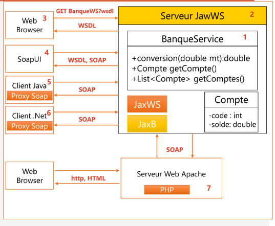

<h1> Web services SOAP WDSL UDDI Use case avec JAXWS</h1>

<h1>Introduction</h1>

Le But de ce projet c'est de mettre en pratique L'architecture de base des Web Services <strong>SOAP
WDSL UDDI </strong> et mise en œuvre des web services avec <strong>JAX-WS</strong> en utilisant l'approche coté client 
web service et coté serveur HTTP.

<h1>Concept Générale :</h1>
<h3>Architecture de base des Web Services :</h3>

<h1>Concept de la l'application :</h1>
<h5>1. Créer un Web service qui permet de :</h5>
<li>Convertir un montant de l’auro en DH</li>
<li>Consulter un Compte</li>
<li>Consulter une Liste de comptes</li>
<h5>2. Déployer le Web service avec un simple Serveur JaxWS</h5>
<h5>3. Consulter et analyser le WSDL avec un Browser HTTP</h5>
<h5>4. Tester les opérations du web service avec un outil
comme SoapUI ou Oxygen</h5>
<h5>5. Créer un Client SOAP Java</h5>
<h5>6. Créer un Client SOAP Dot Net</h5>
<h5>7. Créer un Client SOAP PHP</h5>
<h5>8. Déployer le Web Service dans un Projet Spring Boot</h5>
<h3>La structure du projet :</h3>

<h3>Architecture de l'application </h3>

<h3>POM.XML :</h3>
Après définitions des models. il faut vérifier dans le fichier xml les dépendences suivantes :

<h3>WSDL</h3>
Pour voir la description de web service sous format XML

Pour tester le web service on a utilisé l'outil <stonge>SaopUI</stonge>
<li>Convert Request 1

<li>getCompte Request 1

<li>listCompte Request 1

Un exemple de test si on veux juste visualiser le solde et le code

<h3>La partie client JAVA</h3>
On a besoin d'ajouter un Plugins qui s'appelle <strong>Jakarta EE : web service</strong>.

<h1>Conclusion :</h1>
Cette application pratique a pour but de mettre en pratiques 3 notions principaux :

- Créer un web service

- Consulter et analyser le WSDL avec un Browser HTTP

- Créer un Client SOAP Java

